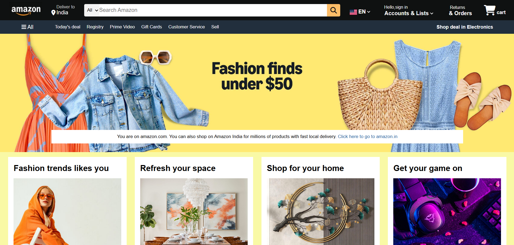

# Amazon Homepage Clone

Responsive Amazon homepage clone built using HTML5 and CSS3.

## Features

- Responsive Design
- Flexbox Layout
- Navigation Bar
- Hero Section
- Product Cards
- Footer

## Technologies Used

- HTML5
- CSS3
- Flexbox
- Media Queries

## Live Demo

https://tanvie029-cpu.github.io/Amazon-clone/

## Learning Outcomes

- Responsive Web Design
- Flexbox Layouts
- Media Queries
- Git & GitHub
- GitHub Pages Deployment

## Screenshot

